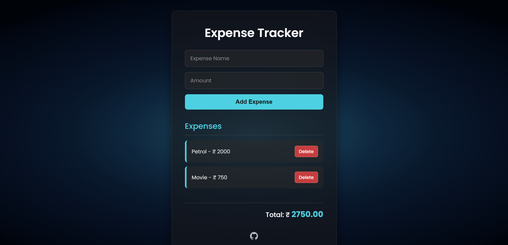

# � Expense Tracker

> A modern, responsive Expense Tracker built with pure JavaScript and CSS. This project is designed for learning and mastering key web development concepts, including DOM manipulation, local storage, event handling, and beautiful UI design.

---



---

## ✨ Features

- Add, view, and delete expenses
- Real-time total calculation
- Persistent data using localStorage
- Responsive, frosted glass UI with deep ocean glow background
- Animated list items and interactive buttons
- Accessible and keyboard-friendly

---

## 📚 Learning Topics Covered

- **HTML5**: Semantic structure, forms, accessibility
- **CSS3**: Modern layouts, gradients, frosted glass effect, responsive design, custom fonts, transitions, and animations
- **JavaScript (ES6+)**:
  - DOM selection and manipulation
  - Event listeners and delegation
  - Array methods (`forEach`, `reduce`, `filter`)
  - Local storage for persistent data
  - Dynamic rendering and state management
  - Input validation and error handling
- **UI/UX**: Clean design, feedback on actions, mobile-first approach

---

## 🚀 Getting Started

1. **Clone the repository**
	```sh
	git clone https://github.com/exceptional007/To-Do-App.git
	```
2. **Navigate to the Expense Tracker folder**
	```sh
	cd To-Do-App/10_ExpenseTracker
	```
3. **Open `index.html` in your browser**

---

## 🖼️ Project Structure

```
10_ExpenseTracker/
│   ├── index.html      # Main HTML file
│   ├── styles.css     # Modern CSS styling
│   ├── scripts.js     # App logic
│   └── assets/        # Favicon and images
└── README.md          # Project documentation
```

---

## 🎨 Styling & Customization

- Uses **Poppins** font for a clean, modern look
- Deep ocean glow animated background
- Frosted glass effect for the main container
- Accent colors for buttons and highlights
- Easily customize colors, fonts, and layout in `styles.css`

---

## 🛠️ How It Works

1. **Add Expense**: Enter a name and amount, then click "Add Expense". The expense is added to the list and saved in local storage.
2. **View Expenses**: All expenses are listed with their amounts. The total is calculated in real time.
3. **Delete Expense**: Click the "Delete" button next to any expense to remove it from the list and local storage.
4. **Persistence**: All data remains even after refreshing or closing the browser, thanks to localStorage.

---

## 📱 Responsive Design

- Works beautifully on desktops, tablets, and mobile devices
- Layout and font sizes adjust for smaller screens

---

## 🤝 Contributing & Learning

This project is open for learning and experimentation. Feel free to fork, modify, and enhance it. Contributions, suggestions, and questions are always welcome!

---

## 📄 License

This project is licensed under the MIT License.
